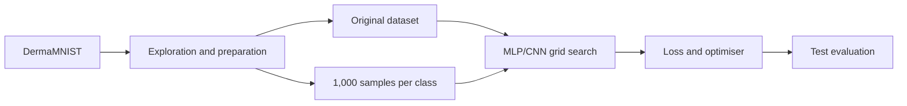

# Skin-lesion classification with MLP and CNN

[Português](README.md) | [English](README.en.md)

Experimental neural-network study on **DermaMNIST**, comparing a Multilayer Perceptron (MLP) and a Convolutional Neural Network (CNN) on balanced and imbalanced versions of the dataset. The work covers data exploration, hyperparameter optimisation, loss-function comparison and per-class evaluation.

> This is an academic image-classification project. The models and results have not been validated for diagnosis or clinical use.

## Objectives

- measure the impact of imbalance across the seven lesion classes;
- compare an MLP and a CNN for dermatological image classification;
- select architectures and hyperparameters through grid search;
- test `CrossEntropyLoss` and `MultiMarginLoss` with Adam and RMSprop;
- evaluate accuracy, precision, recall, F1-score and confusion matrices;
- study whether undersampling and data augmentation improve rare classes.

## Pipeline



The original training set is strongly dominated by *melanocytic nevi*. The balanced experiment used 1,000 observations per class by combining majority-class undersampling with augmentation for underrepresented classes. Validation and test sets kept their original distribution to expose behaviour in a realistic imbalanced setting.

## Key results

| Test scenario | Model | Accuracy | Weighted F1 | Macro F1 |
|---|---:|---:|---:|---:|
| Imbalanced training | MLP | 0.73 | 0.71 | 0.47 |
| Imbalanced training | CNN | 0.75 | 0.71 | 0.47 |
| Balanced training | MLP | 0.63 | 0.66 | 0.44 |
| Balanced training | CNN | 0.68 | 0.71 | 0.56 |

In the loss/optimiser experiments, `CrossEntropy + Adam` reached an F1 of 0.7314 for the imbalanced MLP, while the imbalanced CNN reached 0.7546 with `CrossEntropy + RMSprop`. In the balanced scenario, `CrossEntropy + Adam` was the best reported combination for both models (0.6814 for MLP and 0.6968 for CNN).

The CNN generally extracted spatial patterns more effectively. Balancing improved the CNN's macro F1, but did not eliminate class disparities: aggregate metrics remained influenced by the majority class and some rare lesions retained low recall.

## Technology stack

- Python and Jupyter Notebook;
- PyTorch and torchvision;
- MedMNIST/DermaMNIST;
- NumPy and pandas;
- scikit-learn;
- Matplotlib and seaborn.

## Repository structure

```text
CNN_MLP/
├── CNN_project.ipynb       # CNN preparation, training and evaluation
├── MLP_project.ipynb       # MLP preparation, training and evaluation
├── ACA_relatorio.pdf       # full methodology and discussion
├── requirements.txt
├── README.md
└── README.en.md
```

## Run the notebooks

```bash
git clone https://github.com/josepedrocunhazzz/CNN_MLP_DermatologyClassification.git
cd CNN_MLP_DermatologyClassification
python3 -m venv .venv
source .venv/bin/activate
python -m pip install --upgrade pip
python -m pip install -r requirements.txt
jupyter lab
```

Open `MLP_project.ipynb` or `CNN_project.ipynb` and run the cells in order. Cells using `download=True` download MedMNIST automatically.

Full grid searches and training runs may take considerable time and benefit from a GPU. The notebooks write local `.pth` checkpoints and `.csv` tables; these generated artefacts are excluded from Git.

## Critical interpretation

The report demonstrates why accuracy alone is inadequate for imbalanced medical data. Per-class analysis, macro F1 and confusion matrices expose failures hidden by weighted metrics. Useful next steps include class weights, focal loss, repeated stratified validation, calibration and confidence intervals.

## Academic context

Project presented in **José Cunha's** portfolio. Full academic authorship, experiments, architectures, tables and conclusions are recorded in the [report](ACA_relatorio.pdf).
