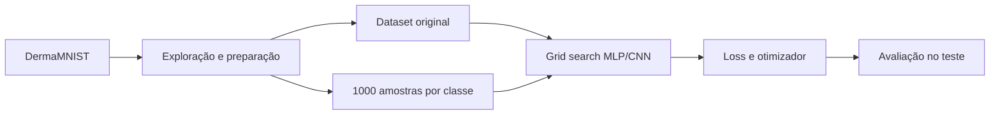

# Classificação de lesões cutâneas com MLP e CNN

[Português](README.md) | [English](README.en.md)

Estudo experimental de redes neuronais aplicado ao **DermaMNIST**, comparando uma Multilayer Perceptron (MLP) e uma Convolutional Neural Network (CNN) em versões balanceada e não balanceada do dataset. O trabalho cobre exploração dos dados, otimização de hiperparâmetros, comparação de funções de perda e avaliação por classe.

> Projeto académico de classificação de imagens. Os modelos e resultados não foram validados para diagnóstico ou utilização clínica.

## Objetivos

- medir o impacto do desbalanceamento entre as sete classes de lesões;
- comparar a capacidade de uma MLP e de uma CNN para classificar imagens dermatológicas;
- selecionar arquiteturas e hiperparâmetros através de grid search;
- testar `CrossEntropyLoss` e `MultiMarginLoss` com Adam e RMSprop;
- avaliar accuracy, precision, recall, F1-score e matrizes de confusão;
- estudar se subamostragem e data augmentation melhoram as classes raras.

## Pipeline



O conjunto de treino original é fortemente dominado por *melanocytic nevi*. Na experiência balanceada foram usadas 1 000 observações por classe, combinando subamostragem da classe maioritária e aumento de dados nas classes com menos exemplos. Validação e teste mantiveram a distribuição original, permitindo observar o comportamento num cenário não balanceado.

## Resultados principais

| Cenário de teste | Modelo | Accuracy | F1 ponderado | F1 macro |
|---|---:|---:|---:|---:|
| Treino não balanceado | MLP | 0,73 | 0,71 | 0,47 |
| Treino não balanceado | CNN | 0,75 | 0,71 | 0,47 |
| Treino balanceado | MLP | 0,63 | 0,66 | 0,44 |
| Treino balanceado | CNN | 0,68 | 0,71 | 0,56 |

Nos testes de função de perda e otimizador, `CrossEntropy + Adam` obteve F1 de 0,7314 na MLP não balanceada; a CNN não balanceada alcançou 0,7546 com `CrossEntropy + RMSprop`. No cenário balanceado, `CrossEntropy + Adam` foi a melhor combinação reportada para ambos os modelos (0,6814 na MLP e 0,6968 na CNN).

A CNN apresentou, no geral, melhor capacidade para extrair padrões espaciais. O balanceamento aumentou o F1 macro da CNN, mas não resolveu as diferenças entre classes: métricas agregadas continuaram influenciadas pela classe maioritária e algumas lesões raras mantiveram recall reduzido.

## Tecnologias

- Python e Jupyter Notebook;
- PyTorch e torchvision;
- MedMNIST/DermaMNIST;
- NumPy e pandas;
- scikit-learn;
- Matplotlib e seaborn.

## Estrutura

```text
CNN_MLP/
├── CNN_project.ipynb       # preparação, treino e avaliação da CNN
├── MLP_project.ipynb       # preparação, treino e avaliação da MLP
├── ACA_relatorio.pdf       # metodologia e discussão completas
├── requirements.txt
├── README.md
└── README.en.md
```

## Executar os notebooks

```bash
git clone https://github.com/josepedrocunhazzz/CNN_MLP_DermatologyClassification.git
cd CNN_MLP_DermatologyClassification
python3 -m venv .venv
source .venv/bin/activate
python -m pip install --upgrade pip
python -m pip install -r requirements.txt
jupyter lab
```

Abrir `MLP_project.ipynb` ou `CNN_project.ipynb` e executar as células por ordem. O MedMNIST é descarregado automaticamente pelas células que usam `download=True`.

O grid search e os treinos completos podem ser demorados e beneficiar de GPU. Os notebooks guardam localmente checkpoints `.pth` e tabelas `.csv`; estes artefactos gerados estão excluídos do Git.

## Leitura crítica

O relatório evidencia por que a accuracy isolada não é suficiente em dados médicos desbalanceados. A análise por classe, o F1 macro e as matrizes de confusão revelam falhas escondidas pelas métricas ponderadas. Como continuação, faria sentido testar class weights, focal loss, validação estratificada repetida, calibração e intervalos de confiança.

## Contexto académico

Projeto apresentado no portefólio de **José Cunha**. A autoria académica completa e a descrição detalhada das experiências, arquiteturas, tabelas e conclusões encontram-se no [relatório](ACA_relatorio.pdf).
